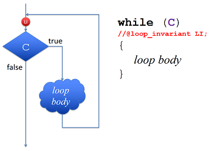
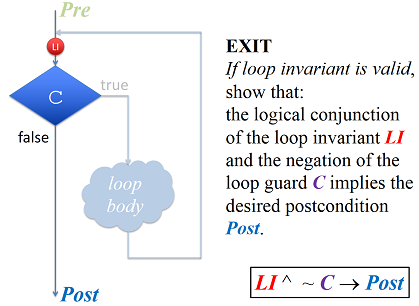
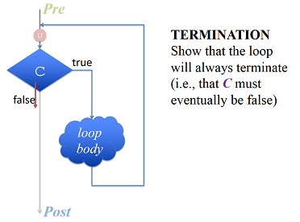
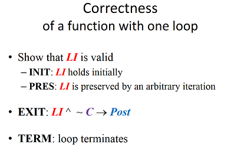
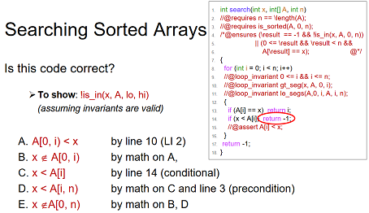
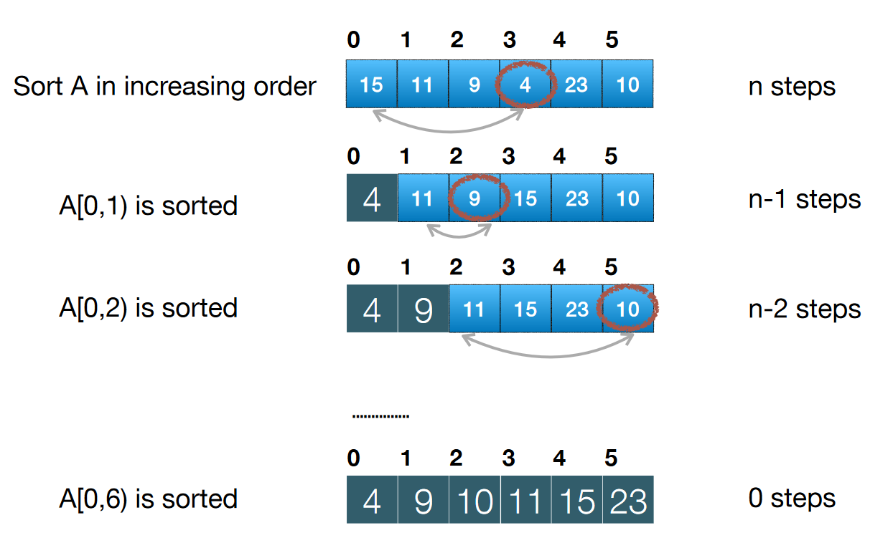

# CMU CS 15-122

> 参考资料：[Lecture Notes/Slides](https://www.cs.cmu.edu/~15122/schedule.shtml), [Homework](http://www.cs.cmu.edu/~fp/courses/15122-f15/assignments.html), [Recitation](http://www.cs.cmu.edu/~fp/courses/15122-f15/schedule.html), [C0 Language](http://c0.typesafety.net/tutorial/)

#### Environment setup

1.Download C0 compiler and config PATH.

```bash
export PATH=$PATH:$Path_to_cc0_bin
```

2.Try both Vim and Emacs to edit a simple file. Type in simple statements and save.

3.Compile your c0 file and run. **"-d" flag means dynamic check** and will check **all function contracts start with //@.**

```bash
cc0 -d factorial.c0
./a.out
```

4.Or, you can run your code in the interpreter **coin**.

```bash
$ coin -d factorial.c0
$ C0 interpreter (coin)
Type ‘#help’ for help or ‘#quit’ to exit.
--> factorial(2);
--> factorial(3);
```

> On my W530, installed C0 compiler at /opt/C0/cc0/bin; PATH added in .bashrc.

## Lecture 1 Contracts

> Contracts will play a central role in this class, since they represent the key to connect algorithmic ideas to imperative programs.

```c
// A mysterious function
int f(int x, int y)
{
  int r = 1;
  while (y > 1) {
    if (y % 2 == 1) {
      r = x * r;
    }
    x = x * x;
    y = y / 2;
  }
  return r * x;
}
```

* First try out the function.Seems it returns x^y, but doesn't make sure y is positive. We should make sure y&gt;0. To implement a precondition in C0:
* To invoke coin with **contract enabled,** use $ coin **-d** mystery.c0.
* Post condition ensures that the function return the correct result, POW\(x,y\)

```c
int f(int x, int y)
//@requires y >= 0;                 <= This is how preconditon is implemented.
//@ensures \result == POW(x,y);     <= This is how post condition is implemented.
{
...
}
```

* //@requires + //@ensures =&gt; **safe and correct** function =&gt; contract of a function.
* In order to understand the loop, we introduce **loop\_invariant. Loop invariant abstracts the behavior of a loop.**
* By hand calculating the loop, we discovered that x ^ y is constant through the loop. Proof

$$
x' = x\cdot x, y' =y/2 \\
x' ^{y'} = (x\cdot x)^{y/2} =x^y
$$

```c
int f(int x, int y)
//@requires y>=0;
//@ensures \result==POW(x,y);
{
...
while (e>1)
//@loop_invariant POW(b,e)*r;
{
...
}
return r*b;
}
```

* Lastly, we have //@assert e==0; after the loop.
* There are only four directives in C0: //@requires, //@ensures, //@loop\_invariant, //@assert.

#### Conclusion

* We need to make sure a function is safe\(pre-condition\) and correct\(post condition\).
* Learned to use //@requires, //@ensures, //@loop\_invariant, //@assert
* 注意loop\_invariant判断的timing，是在loop guard之前，loop循环之后。
* 总结起来，这一课就是教了**一种系统的，确认function功能正确的理论方法**，和工具，以及如何分析function正确性的推理过程。比如如何确认循环的初始条件，如何推理退出循环时的数值，如何证明结果是正确的。
* 证明loop invariant**有效性\(validity\)**的一般流程:



1. 证明loop\_invariant在初始的时候是被保证的
2. 证明在任意循环步结束后，再过一次循环体，loop\_variant同样保持正确

* 证明程序**正确性\(correctnes\)**的流程：



在loop\_invariant被保证的情况下，证明组合loop invariant和loop guard的否，可以导出post条件

* 证明循环一定会结束\(termination\)：这个一般不需要太过详细的证明



* 总结：证明程序的正确性主要有几大步骤：**证明loop invariant有效，证明循环会终止，以及证明程序最后符合post condition**



* C0语言的gotcha : 1. 没有break语句来脱出循环; 2. print\(\)在收到换行符号之前不会显示到屏幕，需要用println\(\); 

## Lecture 2 Integer 

* Binary representation of integers, two's complement

```text
$ coin -l util
--> 0xAB;
171 (int)
--> int2hex(171);
"000000AB" (string)
```

* Modular arithmetic : same law as normal arithmetic!
* Two's complement representation for negative numbers
* Safety requirement for x/y and x%y:

```text
//@requires y!=0;
//@requires !(x == int_min() && y == -1); 
```

* Example : use a integer to represent color \(32bit, 8bit alpha, 8bit red, 8bit green, 8bit blue\)
* Bitwise operators : &, \|, ~, ^, &lt;&lt;, &gt;&gt;

```text
// Example, return the opacity of color P
int opacify(int p) {
return
}
```

* Rule of bit shifting:
* shifts x by k bits to the right o **k rightmost bits are dropped**
* **k leftmost bits are a copy of the leftmost bit** =&gt; sign extension
* Shifting operator safety : **//@requires 0 &lt;= k && k &lt; 32;**
* Conclusion: 这一课主要就是整数的2进制表示，在c0也并没有长短以及符号，只要考虑32位有符号数即可。关于安全性，这一课的知识点就是**位移运算不能移动负数位，或者大于31位**。

## Lecture 3 Array

* Using array. Notation in C0 is similar with Java.

```text
% coin
-->int[] A = alloc_array(int, 10);
A is 0xECE2FFF0 (int[] with 10 elements)
```

* C0 memory model : **local memory** \(only for small type\), **allocated memory** \(for big data, for example, array\); pointers \(addresses of data\) can be stored in local.
* alloc\_arrary\(t, n\) : allocate memory for n type t variables. **Precondition: n&gt;=0, post condition, length of the array == n.**
* A\[i\] : access element of the array. **Precondition: 0&lt;= i &lt; n.**

```c
int[] X = alloc_array(int, 40);
// Contracts for array operations:
//alloc_array(t,n)
//@requires n>=0;
//@ensures \length(result)==n;

X[0] = 1;
// Contracts for accessing:
//@requires 0<=i && i < \length(X); <= \length也是一个contract特殊指令

int[] Y = X; // Y now also point to the same memory.
Y==X; // <= true
```

* Task : to write a function, which can **deep copy** an array.

```c
// First attempt
int[] array_copy(int[] A)
{
  return A;
}

int main()
{
  int[] X = alloc_array(int,10);
  int[] Y = array_copy(X);
}
// Y now become an alias of X, not deep copy.
```

```c
// Second attempt
int[] array_copy(int[] A, int n)
//@requires n==\length(A); //<=呼叫程序的时候，长度n应该与A相同否则含义不明
{
  int[] B = alloc_array(int, n);
  for (int i = 0; i<n; i++)
  //@loop_invariant 0 <= i;
  {
    B[i] = A[i];
  }
  return B;
}
```

* 第一种尝试就是直接把源数组的地址返回出来，这显然不是复制；第二种则是在函数中新建立一个数组，复制好内容以后返回，这里需要小心的是，新建数组的大小是多少，需要强制用户输入一个和源数组一样的数字，否则就是违反安全性
* Using For-Loops to Traverse Array:

```text
--> for(int i = 0; i < 10; i++)
... A[i] = i*i*i;
--> A[6];
216 (int)
```

* How to prove loop safety? \(Accessing A\[i\] and B\[i\]\)

```text
//@loop_invariant 0 <= i;
// i<n is secured by the loop guard.
```

* Practice : Exercise 1. Write a function array  _part that creates a copy of a part of a given array, namely the elements from position i to position j . Your function should have prototype int \[\] array_  part\( int \[\] A, int i, int j\);

```c
#use <conio>
#use <string>

int[] array_part(int[] A, int i, int j)
//@requires i>=0 && j>=i;
//@requires j<\length(A);
//@ensures \length(\result)==j-i+1;
{

  int[] B = alloc_array(int, j-i+1);
  for (int m=0; m<j-i+1; m++)
  //loop_invariant m>=0;
  //loop_invariant m+i>=0 && m+i<\length(A);
  {
    B[m] = A[m+i];
  }
  return B;
}

```

## Lecture 4 Linear search

* Search a number in a sorted array; first attempt:

```c
int search(int x, int[] A, int n)
{
  for(int i = 0; i < n; i++){
    if(A[i] == x) return i;
  }
  return -1;
}
```

## Lecture 5 Big-O notation, Selection sort

#### Big-O analysis on linear search \( on unsorted array, sorted array -&gt; both O\(n\)\)

* Last time developed a linear search function, how much time does that cost?
* Big-O notation : big-O is a upper bound for the run-time of a function. Also, this means we only look at the highest order of a function, and ignore constants
* 再次强调Big-O是upper bound的概念，也就是说少于一个量级的，都可以称作属于O（这个量级），参考下面这个集合算式：

$$
O(1) \subseteq O(log(n)) \subseteq O(nlog(n)) \subseteq O(n) \subseteq O(n^2) \subseteq O(2^n) \subseteq O(n!)
$$

* Worst case analysis: How many steps executed in linear search?

```c
int linear_search (int[] A, int x, int lo, int hi)
{
  for (int i = lo; i < hi; i++){
    if (A[i] == x) return i;
  }
  return -1;
}
```

* 仔细分析可以得出，i&lt;hi, i++, A\[i\]==x这些语句是每个元素都会执行一次，而最坏情况下，一共寻找n个元素，再算上i=0, return这些语句，**总共是3n+3个运算步**。根据Big-O的定义，这**既可以叫O\(n\)，也可以叫O\(n^2\)，甚至O\(n!\)**，但是一般我们希望最简洁，**最接近真实的Big-o**，所以说这是一个O\(n\)的复杂度。
* **Big-O formal definition: O\(g\(n\)\) = { f\(n\): there exist n0 in N and real c &gt;0 such that f\(n\) ≤ cg\(n\) , for all n ≥ n0 }**。**理解1**：存在某个n0，也就是说只考虑足够大的情况，在小数情况下大小并没有关系；**理解2**：存在常数C，结果也就是告诉你忽略常数系数，常数系数大小都不影响Big-O。
* Can we improve linear search?
* * For unsorted array, no.
  * For sorted array, there is chance to reduce steps. But analysis on linear search on a sorted array -&gt; Still O\(n\) because of worst case.

#### Sorting \(Selection sort\)

* A linear search on sorted array:

```c
int search(int[] A, int x, int n)
//@requires n==\length(A);
//@requires is_sorted(A,0,n);    // <= 这里是添加的确保A已排序条件
/*@ensures (\result==-1 && is_in(x,A,0,n)) ||
            \result>=0 && \result<n && A[\result]==x;
@*/
{
  for(int i = 0; i < n; i++)
  //@loop_invariant i>=0 && i<n;
  //@loop_invariant !is_in(x,A,0,i);
  {
    if (A[i]==x) return i;
    if (x<A[i]) return -1;        // <= 这个提前退出增加后，程序还正确吗？
    //@assert A[i]<x;             // <= 这里利用sorted特性告诉程序提前退出
  }
  return -1;
}
```

* 证明提前退出条件增加后程序是正确的：





* Selection sort是最简单的一种排序方法，大致步骤是从序列中先线性搜索，找出一个最小值将其排到第一位，然后从第2个元素开始再找最小，再排到第2位这样一直到结束。整个过程需要的步数是：

$$
Total = n+(n-1)+(n-2)+...+2+1=\frac{n(n+1)}{2}\subseteq O(n^2)
$$

* 为实现Selection sort需要两个帮助函数，一个是find\_min用来返回一段数组中的最小数，另一个是swap，用来把找到的最小元素排到数组头上去。find\_min是一个需要循环的函数，然后selection sort本身也需要循环调用find\_min，这里就需要证明这两个循环是安全且正确的。


