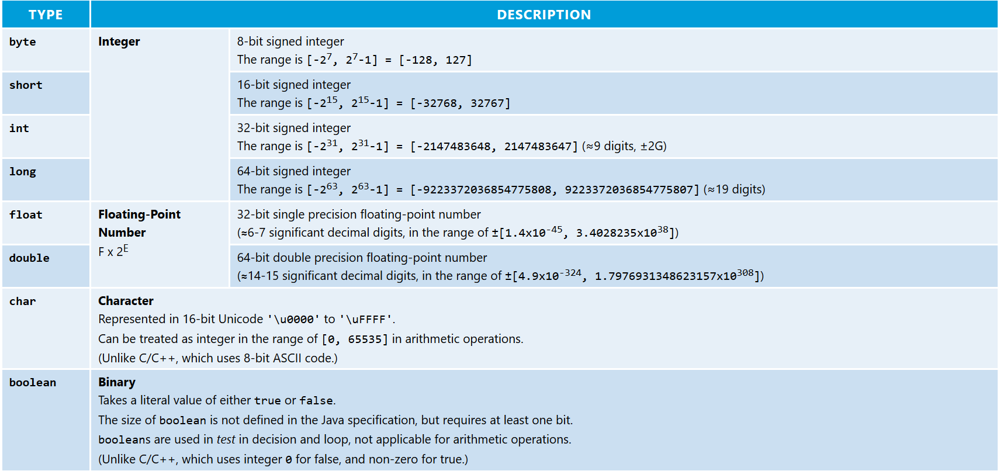

# NTU Java Tutorial

> 这是一个南洋理工的计算机系的[Java教程系列](https://www.ntu.edu.sg/home/ehchua/programming/java/J2_Basics.html)。Follow这个系列的主要目的是因为它后面准备了很多关于多态，接口，容器的内容。

### Basics

* Java里的变量可以分为两大类：基本类型和引用类型。引用类型即数组和对象，会在后面介绍。
* 基本类型的l变量包括以下这些，另外String当然也是常用的类型但是String不是基本型：



* 关于整数和浮点数的二进制表达，可以参考[这里](https://www.ntu.edu.sg/home/ehchua/programming/java/DataRepresentation.html)。
* 在数值的表达中，有以下一些小技巧。**下划线在数字中默认是忽略的，只是提高可读性**：

```java
final String greeting = "Hello !"; // 常量
int num1 = 1234;                   // 10进制
int num2 = 0123;                   // 0开头表示8进制的123
int num3 = 0x10;                   // 0x开头表示16进制
int num4 = 0b0010_1100;            // 0b开头2进制，可以用_来区分位数
```


